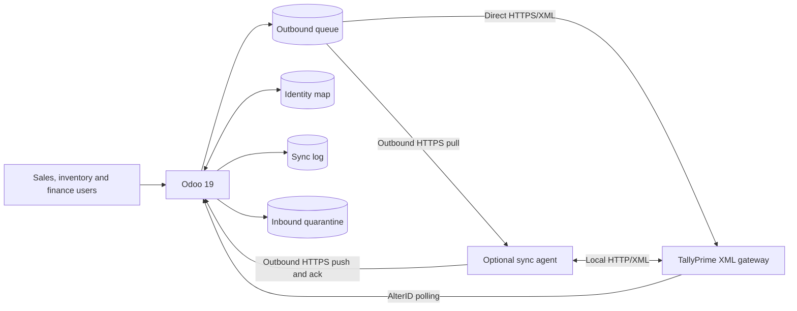
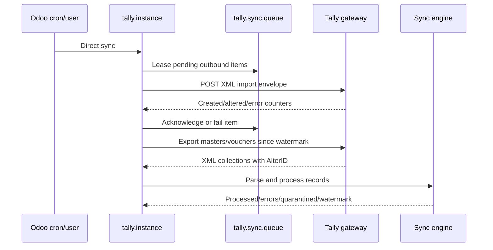
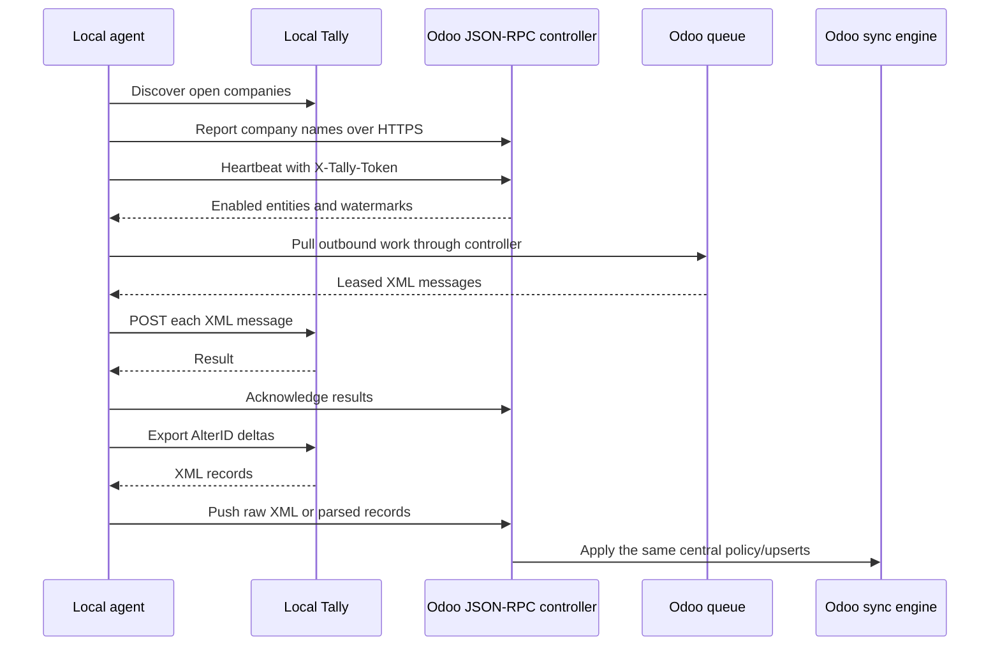
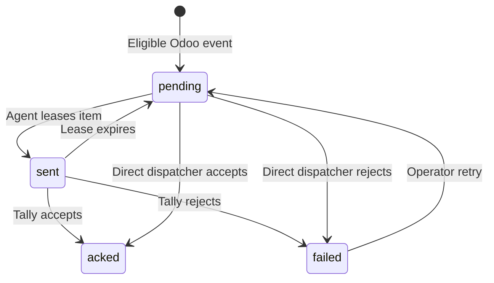
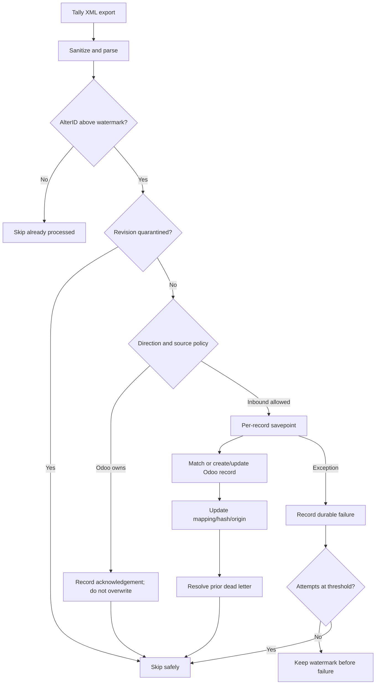

# End-to-End Architecture

## 1. Purpose and design principles

The integration coordinates two independent accounting/inventory systems without pretending they
share one database or one transaction. Its architecture therefore prioritizes explicit ownership,
stable identity, retryability, auditability, and safe recovery over an unrealistic distributed
ACID transaction.

Design principles:

1. **Configuration over hard-coded ownership.** Direction and source of truth are defined per
   entity type.
2. **At-least-once transport, idempotent business delivery.** A message may be retried; stable GUIDs,
   mappings, hashes, and Tally Create/Alter behavior prevent business duplication.
3. **No sync loop.** Imported records carry origin context; mappings record the last accepted origin
   and payload hash.
4. **No silent loss.** Retryable inbound failures block the relevant watermark. Repeated poison
   records are quarantined with their payload before progress resumes.
5. **No broad rollback for one record.** Inbound records use database savepoints.
6. **Company isolation.** Instances, mappings, queues, logs, and quarantine records are company
   scoped.
7. **Safe restored environments.** A database UUID guard prevents a cloned database from behaving
   as the original production integration.
8. **Tally remains private.** Direct mode requires a protected route; agent mode needs only outbound
   HTTPS from the customer network.

## 2. System context

Odoo owns configuration, transformation, policy, identity, persistence, and monitoring. The
optional agent is deliberately thin: it bridges a private network but does not contain independent
business mapping rules.

## 3. Deployment topology A — direct

Use direct mode when Odoo can securely reach the Tally host.

Recommended network patterns are private routing/VPN, an IP allow-listed host, or an HTTPS reverse
proxy with authentication. Tally's native gateway is not an internet authentication boundary.

## 4. Deployment topology B — outbound-only agent

Use agent mode when Tally is on a local workstation/LAN and inbound connectivity is prohibited.

The token identifies one `tally.instance`. Queue leases expire after ten minutes so work held by a
crashed agent returns to pending on the next pull.

## 5. Logical components

| Component | Responsibility |
|---|---|
| `tally.instance` | Connection, credentials, company binding, operating mode, schedules, defaults and actions |
| `tally.entity.config` | Entity enablement, direction, source of truth, ordering and AlterID watermark |
| Standard model hooks | Observe eligible Odoo create/write/post/transfer events without changing core schemas |
| `tally_xml_builder` | Produce escaped Tally master/voucher envelopes and export requests |
| `tally_xml_parser` | Sanitize and normalize Tally XML into typed dictionaries |
| `sync_engine` | Enforce policy, echo suppression, matching, upsert, posting and watermark rules |
| `tally.mapping` | Stable Tally GUID ↔ Odoo model/id identity, origin and content hash |
| `tally.sync.queue` | Durable Odoo→Tally work and delivery state |
| `tally.inbound.dead.letter` | Durable record-revision failures, quarantine and targeted replay |
| `tally.sync.log` | Operational audit and record links |
| Agent controllers | Authenticated heartbeat, discovery, work leasing, inbound delivery and acknowledgements |
| `agent/tally_agent.py` | Local connectivity bridge and scheduler |

## 6. Outbound lifecycle

1. A guarded hook runs after the Odoo business operation succeeds.
2. It selects active instances for the company and eligible entity configuration.
3. Dependencies such as party, account, product, tax, UoM, or godown are enqueued before a voucher.
4. `outbound_guid()` creates a deterministic UUID from database UUID, instance, entity, model and
   record id, unless a genuine Tally GUID already exists.
5. The XML builder escapes values and generates the supported Tally structure.
6. `register_outbound()` compares mapping origin/content hash and suppresses echoes or unchanged
   repeat delivery.
7. The durable queue stores XML and an idempotency key.
8. Direct mode dispatches it to Tally; agent mode leases it to the local agent.
9. Tally response counters determine acknowledged or failed state and an audit log is written.

## 7. Inbound lifecycle

The batch watermark advances only when no retryable error remains. A quarantined revision is a
deliberate, visible exception: its complete normalized payload and error remain available while the
entity continues. Releasing it rewinds only its entity watermark to one less than its AlterID.

## 8. Identity and conflict policy

Matching uses the strongest available identity:

1. Existing Tally GUID mapping.
2. Government/business identity such as GSTIN/PAN for parties or SKU/reference for products.
3. Company-scoped normalized name as a controlled fallback.

Policy is separate from transport direction:

| Source policy | Inbound behavior | Outbound behavior |
|---|---|---|
| Tally | Tally change updates Odoo | Imported content is not echoed |
| Tally master | Tally updates Odoo; intended read-only ownership | Odoo edits are suppressed |
| Odoo | Tally revision is observed but does not overwrite mapped Odoo data | Odoo changes are eligible |
| Bidirectional | Serialized arrival order applies | Both directions eligible with echo suppression |

“Bidirectional” does not mean two users can edit the same record simultaneously with a magical
field merge. The dispatcher runs before pull, then origin/hash rules decide whether the Tally
read-back is an acknowledgement or a genuine later edit. High-conflict domains should have one
declared business owner.

## 9. Transaction boundaries and consistency

- Odoo business records are committed by normal Odoo transactions.
- Queue creation occurs in the same Odoo transaction as the observed hook when possible.
- Network delivery is asynchronous; Tally and Odoo cannot commit atomically together.
- Each inbound record is isolated by a savepoint so one failure does not roll back earlier valid
  records in the batch.
- An entity watermark represents safe consumed progress, not merely the highest value seen.
- Repeated delivery is expected and must remain safe.

This is an eventually consistent integration. “Near real time” means scheduled polling/queue
dispatch at the configured interval, not an event pushed natively by Tally.

## 10. Failure modes and recovery

| Failure | Behavior | Recovery |
|---|---|---|
| Tally unavailable | Outbound stays pending/failed; inbound watermark unchanged | Restore route/Tally and retry |
| Agent crashes after lease | Item remains `sent` temporarily | Next agent pull reclaims leases older than 10 minutes |
| Tally rejects XML | Queue records error and attempts | Correct mapping/data, retry item |
| One malformed inbound record | First attempts block watermark | Correct source; at threshold it is quarantined |
| Quarantined record corrected | Operator releases record | Entity watermark rewinds to AlterID−1 |
| Odoo database cloned | UUID mismatch guard stops integration | Explicitly bind intended environment |
| Duplicate event | Same GUID/hash is detected | Suppressed or handled as Tally Alter |
| Non-standard ledger/voucher | May fail validation/upsert | Add mapping/custom extension and customer UAT |

## 11. Scalability and operational limits

The connector batches work and supports delta polling, but the live release evidence is a functional
round trip rather than a maximum-throughput benchmark. Before a large deployment, test representative
master counts, at least 10,000 vouchers, Tally gateway response time, Odoo worker limits, agent restart,
and multi-day operation. Tally's gateway and company configuration usually determine throughput.

## 12. Extension boundaries

Add new behavior by preserving these layers:

1. Add the entity constant/configuration.
2. Add parser and builder functions with isolated tests.
3. Add one sync-engine upsert and handler registration.
4. Add guarded outbound hooks only where an actual Odoo lifecycle event exists.
5. Reuse mappings, queue, logging, company rules, and quarantine.
6. Add customer-neutral documentation and live UAT evidence.

Do not place business transformation logic in the local agent, bypass mappings for “quick” imports,
advance a watermark past retryable failures, or make Tally network errors break core Odoo writes.

## 13. Architecture decision summary

| Decision | Reason |
|---|---|
| Native Tally XML gateway | No proprietary desktop plugin or custom TDL required for standard scope |
| Direct plus optional agent | Covers routable/cloud and private-LAN installations with one business engine |
| Dedicated mapping table | Avoids custom columns on every Odoo business model |
| Durable queue | Separates user transactions from unreliable network delivery |
| AlterID watermark | Efficient incremental inbound polling |
| Dedicated inbound quarantine | Prevents one poison record from stalling a whole entity while retaining evidence |
| Per-entity authority | Different organizations assign ownership differently |
| LGPL-3 distribution | Encourages transparent adoption, review, contribution, and Scidecs brand reach |
